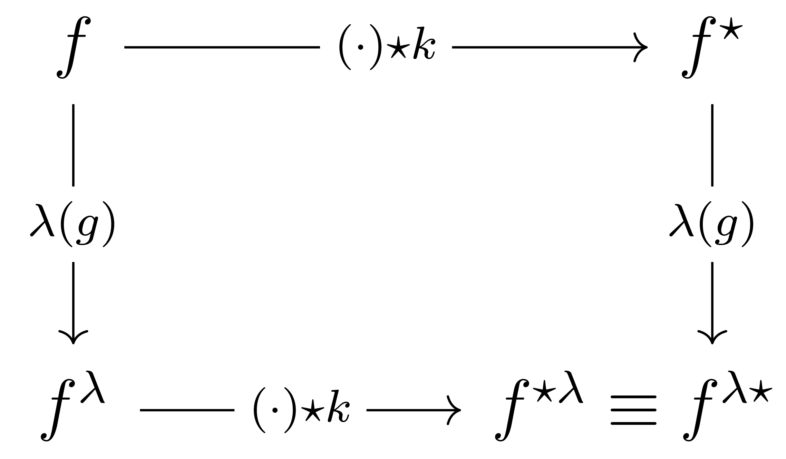

# Translation Group $(\mathbb{R}^2,+)$

## Translation $G$-morphism in convolution

Cross-correlations and convolutions are closely related operations involving the application of a kernel or filter to input data. In cross-correlation, the kernel is slid over the input signal, computing element-wise multiplications between the kernel and corresponding portions of the input signal at each position. The resulting multiplications are summed to yield the cross-correlation value. 

Conversely, in convolution, the kernel is first flipped (reflected) horizontally and vertically. The flipped kernel is then slid over the input signal, performing element-wise multiplications, and summing them to obtain the convolution value. In essence, cross-correlation can be viewed as a non-reflected convolution, and convolution as a cross-correlation with a reflected kernel.

In the case of $\mathbb{R}^2$, the cross-correlation of a kernel $k: \mathbb{R}^2 \rightarrow \mathbb{R}$ at position $\mathbf{x} \in \mathbb{R}^2$ with an input signal $f: \mathbb{R}^2 \rightarrow \mathbb{R}$ is defined as an integral transform. This operation involves translating the kernel to position $\mathbf{x}$, multiplying it with the function $f$, and taking the inner product (integral):

$$
\left(f \star k\right)(\mathbf{x}) = \int f\left(\mathbf{y}\right) k\left(\mathbf{y} - \mathbf{x}\right) d \mathbf{y} \qquad \text{(1)} 
$$ 

Here, the kernel $k$ is translated to $\mathbf{x}$. This translation aligns the kernel with the input signal $f$ at the specified position $\mathbf{x}$. The resulting inner product is computed by multiplying the translated kernel $k\left(\mathbf{y}-\mathbf{x}\right)$ with the function $f\left(\mathbf{y}\right)$ and integrating over $\mathbf{y}$.

When we say we are sliding the kernel to position $\mathbf{x}$, what we really mean is that we are computing the output of the cross-correlation at position $\mathbf{x}$. The kernel itself is being slid across the entire image, and for each position $\mathbf{x}$ of the output, we're looking at how the kernel aligns with the image around that position.

The term $k(\mathbf{y}-\mathbf{x})$ represents the kernel centered at $\mathbf{x}$. The subtraction $\mathbf{y}-\mathbf{x}$ gives the relative position of the kernel with respect to its center at $\mathbf{x}$.

The image function $f$ is evaluated at all positions $\mathbf{y}$ because we are looking at how the kernel, when centered at $\mathbf{x}$, aligns with the image over a range of positions around $\mathbf{x}$. The kernel has a certain size or footprint, so when it is centered at $\mathbf{x}$, it overlaps with the image over a range of positions, not just at $\mathbf{x}$. This is why we need to consider $f(\mathbf{y})$ for all $\mathbf{y}$ in the vicinity of $\mathbf{x}$.

In essence, for each position $\mathbf{x}$ in the output, the cross-correlation operation looks at how the kernel, centered at $\mathbf{x}$, aligns with the image over a range of positions around $\mathbf{x}$. This is captured by the product $k(\mathbf{y}-\mathbf{x}) f(\mathbf{y})$ and the summation over all $\mathbf{y}$.

Consider the input image $f$ and the kernel $k$ as:

$$
f = 
\left(\begin{smallmatrix}
1 & 2 & 3 & 4 & 5 \\
6 & 7 & 8 & 9 & 10 \\
11 & 12 & 13 & 14 & 15 \\
16 & 17 & 18 & 19 & 20 \\
21 & 22 & 23 & 24 & 25 \\
\end{smallmatrix}\right)
\quad
k = 
\left(\begin{smallmatrix}
a & b & c \\
d & e & f \\
g & h & i \\
\end{smallmatrix}\right)
$$

When the kernel is slid such that its center aligns with the position $(2,2)$ of the image (the value 13 in our example), the top-left cell of the kernel (with value $a$) will align with the position $(1,1)$ of the image (the value 7 in our example).

Now, let us understand the $\mathbf{y} - \mathbf{x}$ computation for this specific cell.
$\mathbf{x}$ is the position in the image where the center of the kernel is currently aligned. In our example, $\mathbf{x} = (2,2)$.
$\mathbf{y}$ is the position in the image that corresponds to a specific cell in the kernel. For the top-left cell of the kernel (value $a$), $\mathbf{y} = (1,1)$.
So, $\mathbf{y} - \mathbf{x}$ for the top-left cell of the kernel when its center is at $(2,2)$ is: $(1,1) - (2,2) = (-1,-1)$.

This result, $(-1,-1)$, indicates the relative position of the top-left cell of the kernel with respect to its center. It tells us that the top-left cell is 1 unit to the left and 1 unit above the center of the kernel.

The cross-correlation $\left(f \star k\right)(\mathbf{x})$ provides a measure of similarity between the kernel $k$ and the input signal $f$ at position $\mathbf{x}$. To perform this operation computationally, we discretise the convolution operation as expressed in *Equation 1* in the discrete domain. Assuming an equidistant discretisation of $\mathbb{R}^2$ with $\Delta {\mathbf{y}}=1$, the discrete form of the cross-correlation is given by:

$$
(f \star k)(\mathbf{x}) 
=\sum_{{\mathbf{y}} \in \mathbb{Z}^2} f({\mathbf{y}}) k(\mathbf{y}-{\mathbf{x}}) \qquad \text{(2)}
$$

The translation $G$-map of cross-correlations arises from the fact that the same convolution operation is performed for every $\mathbf{y} \in \mathbb{Z}^2$. 

The requirement we seek is $G$-map wrt translation:

 
  

where $\lambda(g)$ is a left regular representation of the translation group action.

We can express the $G$-map requirement as:

$$
\lambda(g) (f \star k) = (\lambda(g) f) \star k \qquad \text{(3)} 
$$

### Proof

Given the cross-correlation expressed in *Equation 2* and the left regular group representation $\lambda(g) f(\mathbf{x}) = f(\mathbf{x} - \mathbf{t})$, let us prove *Equation 3*.

Let us use the substitution $\mathbf{y} \rightarrow \mathbf{y}+\mathbf{x}$.

Starting with the left-hand side:

$$
\begin{array}{rl}
\lambda(g) (f \star k)(\mathbf{x}) & = \lambda(g) \left( \sum_{{\mathbf{y}} \in \mathbb{Z}^2} f({\mathbf{y}}) k(\mathbf{y}-{\mathbf{x}}) \right), \\
& = \sum_{{\mathbf{y}} \in \mathbb{Z}^2} f(\mathbf{y} - \mathbf{t}) k(\mathbf{y}-{\mathbf{x}}).
\end{array}
$$

Note here that the left regular group action $\lambda(g)$ is defined to act on the function $f$, not on the kernel $k$. This is a key aspect of the group action: it acts on the elements of a set (in this case, the set of functions that we are cross-correlating with the kernel), and not on the operation itself (in this case, the kernel or the cross-correlation operation). In convolutional neural networks, this group action corresponds to translating the input image (which is represented by the function $f$), not the kernel. The kernel is slid across the image, but it is the image that is being translated by the group action. 

When we write $\lambda(g) (f \star k)(\mathbf{x})$, we are saying translate the image by $g$, then cross-correlate the translated image with the kernel to get the output at position $\mathbf{x}$. This is why, in the proof, we apply the group action to $f(\mathbf{y})$ to get $f(\mathbf{y} - \mathbf{t})$, and not to $k(\mathbf{y}-\mathbf{x})$.

Continuing our proof and using the substitution $\mathbf{y} \rightarrow \mathbf{y}+\mathbf{x}$:

$$
\begin{array}{rl}
& = \sum_{{\mathbf{y}} \in \mathbb{Z}^2} f(\mathbf{y}+\mathbf{x}-\mathbf{t}) k(\mathbf{y}), \\
& = \sum_{{\mathbf{y}} \in \mathbb{Z}^2} f(\mathbf{y}- (\mathbf{t}-\mathbf{x})) k (\mathbf{y}).
\end{array}
$$

Now, the right-hand side:

$$
\begin{array}{rl}
((\lambda(g) f) \star k)(\mathbf{x}) & = \sum_{{\mathbf{y}} \in \mathbb{Z}^2} f(\mathbf{y}-\mathbf{t}) k(\mathbf{y}-\mathbf{x}), \\
& = \sum_{{\mathbf{y}} \in \mathbb{Z}^2} f(\mathbf{y}+\mathbf{x}-\mathbf{t}) k (\mathbf{y}), \\
& = \sum_{{\mathbf{y}} \in \mathbb{Z}^2} f(\mathbf{y}- (\mathbf{t}-\mathbf{x})) k (\mathbf{y}).
\end{array}
$$

This result matches the left-hand side computed earlier, confirming the $G$-map property. We see that a translation followed by a cross-correlation is the same as a cross-correlation followed by a translation.
